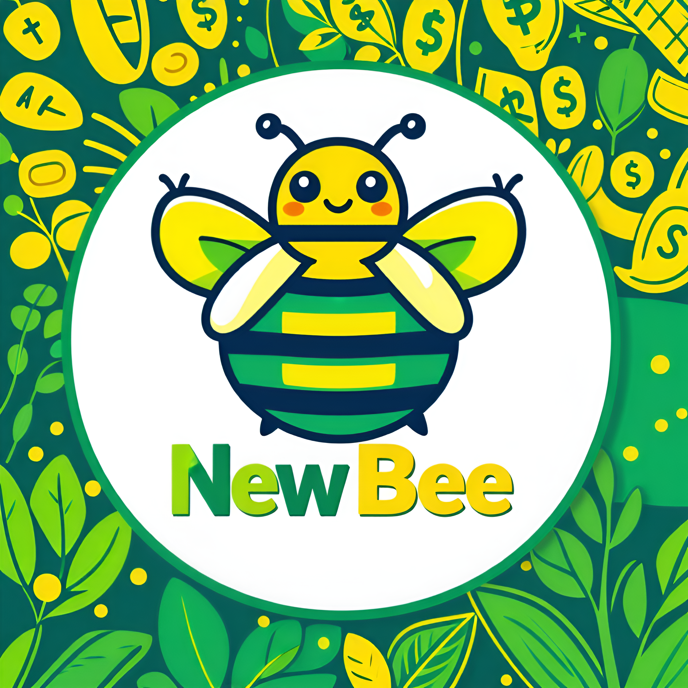

# Hello, guys! We are all NewBee!

## 삼성 청년 SW 아카데미 (SSAFY) 11기 부울경 2반 3조 1학기 관통 프로젝트

## ✅서비스 개요

🪙 서비스 명 : NewBee
📅 개발 기간 : 2024-05-08 ~ 2024-05-24
🤼‍♂️ 개발원 : 👑 윤대영, 최동호

## ✅서비스 구상

🔸 현대 자본주의 사회에서는 그 누구도 금융과 무관할 수 없습니다.

🔸한국은 OECD중에서도 금융 교육에 있어서 상대적으로 부족하다는 지적을 받고 있습니다.

🔸예비 사회 초년생들인 우리 SSAFY 교육생들 또한, 경제, 금융지식이 부족한 상태로 경제활동을 시작하여 어떻게 자산을 관리할지 뒤늦게 정보를 찾아다니게 될 것입니다.

🔸곧 사회에 첫 발을 내딜 우리 사회 초년생들을 위해 예,적금, 연금 저축, 전,월세 대출 정보까지 올바르고 알뜰하게 경제 활동을 할 수 있도록 꿀 정보를 제공하기 위해 제작하였습니다!

## ✅서비스 소개

🔸 로고 : 

🔸서비스 명 : NewBee

🔸의미 : 사회 초년생 (Newbie) 와 꿀벌 (bee)의 합성어로, 사회초년생들에게 알려주는 금융 꿀 정보!

🔸주요 예상 고객층 : 사회 초년생(20대 중후반), 자리 잡기 시작하는 저연차 사회인(30대 초중반)

## ✅ 기술 스택

### Common

🔸 Greate Teacher : 허범성 강사님,   
🔸 형상 관리 :     
🔸 협업 툴 : 

### Back-End

🔸 언어 :    
🔸 프레임워크 :     
🔸 DB :    
🔸 라이브러리 : 

### Front-End

🔸 언어 :     
🔸 프레임워크 :   
🔸 라이브러리 :   

## ✅ 주요 제공 기능

### 금융

🔸 각 종 금융 상품 정보 제공  
    &nbsp; &nbsp;🔹 정기 예금 정보 및 가입  
    &nbsp; &nbsp;🔹 적금 정보 및 가입  
    &nbsp; &nbsp;🔹 연금 저축 정보 및 가입  
    &nbsp; &nbsp;🔹 전, 월세 대출 정보 및 가입  
    &nbsp; &nbsp;🔹 적금, 연금 저축 예상 수령액 계산기  

🔸  가입 상품의 이율 그래프 제공  
🔸  각 종 금융 상품 정보 제공  
🔸  각 카테고리 별 가입자 수 TOP 5 추천 리스트 제공  
🔸  연령대, 자산, 연봉등 비슷한 조건의 유저들이 많이 가입한 카테고리별 상품 TOP 3 리스트 제공  

### 사용자 편의 기능

🔸  커뮤니티  
🔸  환율 계산기  
🔸  NewBee가 알려주는 랜덤 경제 용어  
🔸  각 종 금융 상품 정보 제공  
🔸  경제 뉴스 제공  
🔸  근처 은행 위치 검색  

## ✅ 개발 일지

### 🔗 데이터 모델링( ER 다이어그램 )

### 📅 타임 테이블

😎 윤대영

| 날짜       | 윤대영                                                                                              |
| ---------- | --------------------------------------------------------------------------------------------------- |
| 2024-05-08 | 프로젝트 구상 및 각 기능 명세서 제작, 로고 제작                                                     |
| 2024-05-09 | 각 금융 상품 모델링 및 ERD 설계, Swagger 연결                                                       |
| 2024-05-13 | 회원가입 구현                                                                                       |
| 2024-05-14 | 로그인, 로그아웃, 유저 정보 조회                                                                    |
| 2024-05-16 | 아이디, 닉네임, 이메일 중복 체크 구현, 게시판 댓글 CRUD 구현                                        |
| 2024-05-17 | 회원가입 & 정보변경 아이디, 비밀번호 정규식 적용, 환율 계산기 구현, 정기예금 API 구현               |
| 2024-05-18 | 특정 은행 상품 리스트 조회 구현, 게시판 인증 권한 수정, 적금 API 구현, 연금 API 구현                |
| 2024-05-19 | models 디렉토리 구조 변경, 금융 상품 가입 구현                                                      |
| 2024-05-20 | 가입 상품 조회 구현, 각 금융 상품 리스트 조회 구현, 게시글 좋아요 구현                              |
| 2024-05-20 | 금융 상품 가입 전면 수정                                                                            |
| 2024-05-21 | 경제 용어 사전 구현, 금융 상품 가입 수정, 랜덤 경제 용어 구현, 더미 데이터 (회원가입,상품가입) 구현 |
| 2024-05-22 | 각 상품 별 가입자 수 TOP 5 추천, 비슷한 조건의 유저들 가입 상품 TOP3 추천 구현, 경제 뉴스 API 구현  |
| 2024-05-23 | 최종 점검 및 발표 자료 준비                                                                         |
| 2024-05-24 | 발표                                                                                                |

😘 최동호

| 날짜       | 최동호                                                                                              |
| ---------- | --------------------------------------------------------------------------------------------------- |
| 2024-05-08 | 프로젝트 구상 및 각 기능 명세서 제작, 로고 제작                                                     |
| 2024-05-09 | 각 금융 상품 모델링 및 ERD 설계, Swagger 연결                                                       |
| 2024-05-13 | 회원가입 구현                                                                                       |
| 2024-05-14 | 로그인, 로그아웃, 유저 정보 조회                                                                    |
| 2024-05-16 | 아이디, 닉네임, 이메일 중복 체크 구현, 게시판 댓글 CRUD 구현                                        |
| 2024-05-17 | 회원가입 & 정보변경 아이디, 비밀번호 정규식 적용, 환율 계산기 구현, 정기예금 API 구현               |
| 2024-05-18 | 특정 은행 상품 리스트 조회 구현, 게시판 인증 권한 수정, 적금 API 구현, 연금 API 구현                |
| 2024-05-19 | models 디렉토리 구조 변경, 금융 상품 가입 구현                                                      |
| 2024-05-20 | 가입 상품 조회 구현, 각 금융 상품 리스트 조회 구현, 게시글 좋아요 구현                              |
| 2024-05-20 | 금융 상품 가입 전면 수정                                                                            |
| 2024-05-21 | 경제 용어 사전 구현, 금융 상품 가입 수정, 랜덤 경제 용어 구현, 더미 데이터 (회원가입,상품가입) 구현 |
| 2024-05-22 | 각 상품 별 가입자 수 TOP 5 추천, 비슷한 조건의 유저들 가입 상품 TOP3 추천 구현, 경제 뉴스 API 구현  |
| 2024-05-23 | 최종 점검 및 발표 자료 준비                                                                         |
| 2024-05-24 | 발표                                                                                                |
|            |                                                                                                     |

### 📝 서비스 구현 평가

| NO | 구분              | 기능                                                              | 구현정도(⭐⭐⭐⭐⭐)                                                |
| -- | ----------------- | ----------------------------------------------------------------- | ------------------------------------------------------------------- |
| 1  | 메인페이지        | 메인페이지 레이아웃 및 디자인 CSS                                 | ⭐⭐⭐⭐⭐                                                          |
| 2  |                   | 최신 경제 뉴스, 환율, 금, 유가, 코스피 볼 수 있도록 데이터 크롤링 | ⭐⭐⭐(경제 뉴스 외 정보 시각화 실패)                               |
| 3  |                   | 경제 퀴즈                                                         | ⭐⭐⭐⭐ (카드 뒤집기 기능 구현 실패)                               |
| 4  |                   | 웹 서비스 소개 Carousel 기능 구현                                 | ⭐⭐⭐(캐러셀 기능 구현 성공했으나 활용도 낮음)                     |
| 5  |                   | 최신 게시글 5개 표시 및 게시판으로 이동하기                       | ⭐⭐(구현 실패 -> 실시간 좋아요, 댓글 반영으로 만회)                |
| 6  | 회원 커스터마이징 | 회원 가입 및 로그인/ 로그아웃 기능 및 화면 구현                   | ⭐⭐⭐⭐⭐                                                          |
| 7  |                   | 회원/ 비회원에 따라 화면 다르게 나타나도록 구현                   | ⭐⭐⭐⭐ (모든 화면에 가드를 적용하지는 않음)                       |
| 8  |                   | 회원가입시 아이디 중복확인                                        | ⭐⭐⭐⭐(중복 확인 기능 있으나, 회원가입시 필수 아님)               |
| 9  | 예/적금 금리 비교 | API 활용해 금융 상품 DB 저장                                      | ⭐⭐⭐⭐⭐)                                                         |
| 10 |                   | 관심상품 등록 기능 및 조회                                        | ⭐⭐⭐⭐(등록 및 차트로 정보 확인 가능 상세 페이지 이동 구현 실패) |
| 11 |                   | 상품 상세 정보 화면 구현                                          | ⭐⭐⭐⭐ (CSS가 부족함)                                             |
| 12 |                   | 카테고리별 검색 기능                                              | ⭐⭐(상품 종류별 뷰만 다르게 설정, 검색 기능 없음)                  |
| 13 |                   | 이자계산기 기능 구현                                              | ⭐⭐(백엔드만 구현)                                                 |
| 14 | 환율계산기        | API를 활용한 환율 정보 DB 저장                                    | ⭐⭐⭐⭐⭐                                                          |
| 15 |                   | axios 활용하여 환율 정보 가공 및 화면 구현                        | 구현 실패                                                           |
| 16 |                   | 화폐 선택 시 국기 이미지 표시                                     | ⭐(국가 이름 표시로 대체)                                           |
| 17 | 은행 검색 지도    | API를 활용하여 Kakao 맵 화면 구현                                 | ⭐⭐⭐ (특별한 기능이 없음 + 프론트 배포 시 동작 안함)              |
| 18 |                   | 키워드에 맞는 검색 결과 구현                                      | 구현 실패                                                           |
| 19 |                   | 카카오 맵 마커에 장소 정보 표시                                   | ⭐⭐⭐⭐ (디테일한 정보 부족)                                       |
| 20 | 커뮤니티          | 게시글 및 댓글 CRUD 기능 구현                                     | ⭐⭐⭐⭐⭐                                                          |
| 21 |                   | 게시글 검색 기능 구현                                             | 구현 실패                                                           |
| 22 |                   | 게시글을 카테고리에 따라 작성자 표시를 다르게 구현                | 카테고리 분류하지 않고 게시판 구현                                  |
| 23 | 유저 프로필       | 회원 정보 수정, 비밀번호 변경 기능                                | ⭐⭐⭐⭐⭐                                                          |
| 24 |                   | 회원 탈퇴 기능                                                    | ⭐⭐(문제 원인 파악 불가)                                           |
| 25 |                   | 본인이 작성한 게시글 조회                                         | ⭐(구현 실패, 다만 본인 게시글에만 수정, 삭제 버튼 보임)            |
| 26 |                   | 관심상품 등록한 예/적금 상품 조회                                 | ⭐⭐(가입 상품 정보 그래프화만 가능, 조회 불가)                    |
| 27 |                   | 유저정보에서 입력 받은 정보를 기반으로 상품 추천 알고리즘         | ⭐⭐⭐⭐(사용한 유저 정보량이 부족함)                               |
| 28 |                   | 차트 라이브러리 통해 금리 비교                                    | ⭐⭐⭐⭐ (커스터마이징이 부족함)                                    |
|    |                   |                                                                   |                                                                     |

### 💊 이슈 관리

| 이름   | 내용                                            | 해결여부(Y/N) | 해결과정                                                                                                                                   |
| ------ | ----------------------------------------------- | ------------- | ------------------------------------------------------------------------------------------------------------------------------------------ |
| 최동호 | username 컬럼 충돌                              | Yes           | user_id -> username, username -> realname(실명)으로 필드명 변경                                                                            |
| 윤대영 | 서버 패키지 설치 의존성 에러                    | Yes           | pip install —upgrade pip 명령어 사용 후 pip install -r requirements 재진행 → 해결                                                        |
| 최동호 | viewset 구조에서 댓글 작성시 POST 메서드 허가 X | Yes와 No 사이 | 원인을 찾지 못해서 vieset 구조 버리고 APIView 구조로 변경                                                                                  |
| 최동호 | 게시글 목록이 미 로그인 상태에서도 출력이 안됨  | Yes           | APIView 클래스 내부 전역 변수로 permission_classes = [IsAuthenticated] 설정한 것을 각 메서드에 나누어 적용함으로써 목록 작성에는 인증 제거 |
| 윤대영 | 로그인하고 새로고침 시 로그아웃되는 문제  | Yes           | access, refresh key 로컬 스토리지에 저장 후 토큰 여부로 로그인 상태 관리|
| 윤대영 | 로그아웃 했음에도 로그인한 상태처럼 화면 렌더링 및 권한 부여되는 문제 | Yes           | 로그아웃 시 유저 관련된 정보 모두 초기화함으로써 해결|
| 윤대영 | 댓글, 게시글 작성 시 실시간 반영 느린 문제 | Yes           | 게시글, 댓글 작성시 게시글 정보 재요청하고 다시 게시글로 뷰를 전환시키면서 실시간 반영인 것처럼 느끼게 함|

## 🙋‍♂️ 마치며

### 🤼‍♂️ 구성원 소개

|  |  |
| -------------------- | ---------------------- |
| 최동호               | 윤대영                 |
|                      |                        |

### 소감

#### 윤대영
첫 프로젝트를 경험하면서 프론드엔드에 가지고 있던 막연한 환상이 꺠지는 순간이었습니다. 사용자와 상호작용한다는 점에 매력을 느껴서 프론트엔드가 마냥 좋아보였습니다.
하지만, 이 프로젝트를 하면서 '사용자와 실시간 소통한다는 건 신경 써야할 것들이 너무나도 많구나'라는 걸 절실히 느꼈습니다.
앞으로는 사소한 디테일한 부분들까지도 모두 신경써야겠다는 생각이 많이 들었습니다.

또한, 프론트엔드라고 백엔드의 업무를 제대로 이해하지 못한다면 일의 진행이 굉장히 더디다는 걸 많이 느껴서 백엔드의 흐름도 제대로 이해하려고 노력해야겠다고 느꼈습니다.
허둥지둥 구현에 바빠 체계적으로 컴포넌트, 함수 등 모든 게 한 곳에 집중된 비효율적인 코드를 짰습니다만, 덕분에 다음번엔 체계의 중요성을 알고 일을 진행할 수 있을 것 같습니다.

실력이 부족한 탓에 구현하지 못한 기능들도 많고, 구현을 했지만 디테일을 챙기지 못한 부분들도 많은데 개선해나가도록 하겠습니다.
모든 게 어설프고 서투른 저를 프로젝트 유경험자이자 팀원으로써, 도와주신 최동호 님에게 많이 감사합니다.

#### 최동호

Chat GPT의 대단함과 동시에 더 공부하고 발전하지 않는다면 개발자로서 설자리를 잃을 수도 있겠다는 느낌을 받았습니다. 또한, 같은 반 다른 조들과 다르게 백, 프론트 포지션을 확실하게 나누어 작업을 진행하면서 또 한번 소통의 중요성을 느낄 수 있었습니다.

프론트 엔드 분야 개발을 하지 못한 아쉬움이 남기도 하지만 반대로 이번 프로젝트를 통해 백엔드 개발자로서 프로젝트에 임할 때 협업을 위해 신경써야 하는 부분을 배울 수 있었고 오랜만에 프로젝트 진행이라 마감일 까지 개발을 마무리하기 위한 노력들도 즐거움으로 다가왔습니다.

마감을 지키기 위해 너무 자신의 영역에만 집중한 나머지 프론트 엔드 영역을 담당한 윤대영 군에게 도움이 많이 되지 못한 것 같아 미안함을 느낍니다.

다음 프로젝트는 좀 더 확실한 설계와 계획으로 협업하는 동료들에게 도움 되는 개발자로 발전하겠습니다.

### 노션 링크

https://www.notion.so/NewBee-d1c04a6e220a4f3ea02b926cf8819b5c
