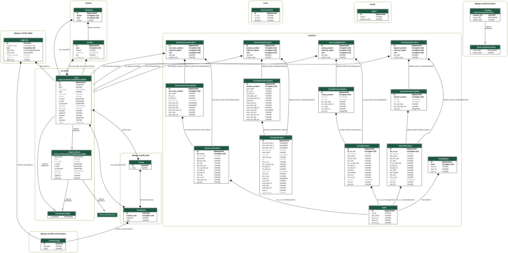

# Hello, guys! We are all NewBee!
## 삼성 청년 SW 아카데미 (SSAFY) 11기 부울경 2반 3조 1학기 관통 프로젝트 
[메인 페이지 사진]

## ✅서비스 개요
🪙 서비스 명 : NewBee \
📅 개발 기간 : 2024-05-08 ~ 2024-05-24 \
🤼‍♂️ 개발원 : 👑 윤대영, 최동호 

## ✅서비스 구상
🔸 현대 자본주의 사회에서는 그 누구도 금융과 무관할 수 없습니다.

🔸한국은 OECD중에서도 금융 교육에 있어서 상대적으로 부족하다는 지적을 받고 있습니다.

🔸예비 사회 초년생들인 우리 SSAFY 교육생들 또한, 경제, 금융지식이 부족한 상태로 경제활동을 시작하여 어떻게 자산을 관리할지 뒤늦게 정보를 찾아다니게 될 것입니다.

🔸곧 사회에 첫 발을 내딜 우리 사회 초년생들을 위해 예,적금, 연금 저축, 전,월세 대출 정보까지 올바르고 알뜰하게 경제 활동을 할 수 있도록 꿀 정보를 제공하기 위해 제작하였습니다!

## ✅서비스 소개
🔸 로고 : 

🔸서비스 명 : NewBee 

🔸의미 : 사회 초년생 (Newbie) 와 꿀벌 (bee)의 합성어로, 사회초년생들에게 알려주는 금융 꿀 정보!

🔸주요 예상 고객층 : 사회 초년생(20대 중후반), 자리 잡기 시작하는 저연차 사회인(30대 초중반)

## ✅ 기술 스택
### Common
🔸 Greate Teacher : 허범성 강사님,   
🔸 형상 관리 :     
🔸 협업 툴 : 

### Back-End 
🔸 언어 :    
🔸 프레임워크 :     
🔸 DB :    
🔸 라이브러리 : 

### Front-End
🔸 언어 :     
🔸 프레임워크 :  

## ✅ 주요 제공 기능
### 금융
🔸 각 종 금융 상품 정보 제공 
    &nbsp; &nbsp;🔹 정기 예금 정보 및 가입 
    &nbsp; &nbsp;🔹 적금 정보 및 가입 
    &nbsp; &nbsp;🔹 연금 저축 정보 및 가입 
    &nbsp; &nbsp;🔹 전, 월세 대출 정보 및 가입 
    &nbsp; &nbsp;🔹 적금, 연금 저축 예상 수령액 계산기  

🔸  가입 상품의 이율 그래프 제공 
🔸  각 종 금융 상품 정보 제공 
🔸  각 카테고리 별 가입자 수 TOP 5 추천 리스트 제공  
🔸  연령대, 자산, 연봉등 비슷한 조건의 유저들이 많이 가입한 카테고리별 상품 TOP 3 리스트 제공  

### 사용자 편의 기능
🔸  커뮤니티  
🔸  환율 계산기  
🔸  NewBee가 알려주는 랜덤 경제 용어  
🔸  각 종 금융 상품 정보 제공 
🔸  경제 뉴스 제공 
🔸  근처 은행 위치 검색  

## ✅ 개발 일지
### 🔗 데이터 모델링( ER 다이어그램 )

### 📅 타임 테이블
😎 윤대영
| 날짜         | 윤대영                                               |
|-------------|------------------------------------------------------|
| 2024-05-08  |  프로젝트 구상 및 각 기능 명세서 제작, 로고 제작 |
| 2024-05-09  | 각 금융 상품 모델링 및 ERD 설계, Swagger 연결 |
| 2024-05-13  | 회원가입 구현 |
| 2024-05-14  | 로그인, 로그아웃, 유저 정보 조회 |
| 2024-05-16  | 아이디, 닉네임, 이메일 중복 체크 구현, 게시판 댓글 CRUD 구현 |
| 2024-05-17  | 회원가입 & 정보변경 아이디, 비밀번호 정규식 적용, 환율 계산기 구현, 정기예금 API 구현 |
| 2024-05-18  | 특정 은행 상품 리스트 조회 구현, 게시판 인증 권한 수정, 적금 API 구현, 연금 API 구현  |
| 2024-05-19  | models 디렉토리 구조 변경, 금융 상품 가입 구현 |
| 2024-05-20  | 가입 상품 조회 구현, 각 금융 상품 리스트 조회 구현, 게시글 좋아요 구현 |
| 2024-05-20  | 금융 상품 가입 전면 수정 |
| 2024-05-21  | 경제 용어 사전 구현, 금융 상품 가입 수정, 랜덤 경제 용어 구현, 더미 데이터 (회원가입,상품가입) 구현 |
| 2024-05-22  | 각 상품 별 가입자 수 TOP 5 추천, 비슷한 조건의 유저들 가입 상품 TOP3 추천 구현, 경제 뉴스 API 구현|
| 2024-05-23  | 최종 점검 및 발표 자료 준비 |
| 2024-05-24  | 발표 |

😘 최동호
| 날짜         | 최동호                                                |
|-------------|------------------------------------------------------|
| 2024-05-08  |  프로젝트 구상 및 각 기능 명세서 제작, 로고 제작 |
| 2024-05-09  | 각 금융 상품 모델링 및 ERD 설계, Swagger 연결 |
| 2024-05-13  | 회원가입 구현 |
| 2024-05-14  | 로그인, 로그아웃, 유저 정보 조회 |
| 2024-05-16  | 아이디, 닉네임, 이메일 중복 체크 구현, 게시판 댓글 CRUD 구현 |
| 2024-05-17  | 회원가입 & 정보변경 아이디, 비밀번호 정규식 적용, 환율 계산기 구현, 정기예금 API 구현 |
| 2024-05-18  | 특정 은행 상품 리스트 조회 구현, 게시판 인증 권한 수정, 적금 API 구현, 연금 API 구현  |
| 2024-05-19  | models 디렉토리 구조 변경, 금융 상품 가입 구현 |
| 2024-05-20  | 가입 상품 조회 구현, 각 금융 상품 리스트 조회 구현, 게시글 좋아요 구현 |
| 2024-05-20  | 금융 상품 가입 전면 수정 |
| 2024-05-21  | 경제 용어 사전 구현, 금융 상품 가입 수정, 랜덤 경제 용어 구현, 더미 데이터 (회원가입,상품가입) 구현 |
| 2024-05-22  | 각 상품 별 가입자 수 TOP 5 추천, 비슷한 조건의 유저들 가입 상품 TOP3 추천 구현, 경제 뉴스 API 구현|
| 2024-05-23  | 최종 점검 및 발표 자료 준비 |
| 2024-05-24  | 발표 |
|   |  |

### 📝 서비스 구현 평가
| NO | 구분             | 기능                                                      | 구현정도(⭐⭐⭐⭐⭐)                                  |
|----|------------------|-----------------------------------------------------------|--------------------------------------------------|
| 1  | 메인페이지       | 메인페이지 레이아웃 및 디자인 CSS                        | ⭐⭐⭐⭐⭐                                           |
| 2  |                  | 최신 경제 뉴스, 환율, 금, 유가, 코스피 볼 수 있도록 데이터 크롤링 | ⭐⭐⭐⭐⭐                                           |
| 3  |                  | 경제 퀴즈                                                 | ⭐⭐⭐⭐ (카드 뒤집기 기능 구현 실패)                |
| 4  |                  | 웹 서비스 소개 Carousel 기능 구현                        | ⭐⭐⭐⭐⭐                                           |
| 5  |                  | 최신 게시글 5개 표시 및 게시판으로 이동하기              | ⭐⭐⭐⭐⭐                                           |
| 6  | 회원 커스터마이징 | 회원 가입 및 로그인/ 로그아웃 기능 및 화면 구현           | ⭐⭐⭐⭐⭐                                           |
| 7  |                  | 회원/ 비회원에 따라 화면 다르게 나타나도록 구현           | ⭐⭐⭐⭐ (모든 화면에 가드를 적용하지는 않음)       |
| 8  |                  | 회원가입시 아이디 중복확인                               | ⭐⭐⭐⭐⭐                                           |
| 9  | 예/적금 금리 비교 | API 활용해 금융 상품 DB 저장                             | ⭐⭐⭐⭐⭐                                           |
| 10 |                  | 관심상품 등록 기능 및 조회                               | ⭐⭐⭐⭐⭐                                           |
| 11 |                  | 상품 상세 정보 화면 구현                                 | ⭐⭐⭐⭐ (CSS가 부족함)                             |
| 12 |                  | 카테고리별 검색 기능                                     | ⭐⭐⭐⭐⭐                                           |
| 13 |                  | 이자계산기 기능 구현                                     | ⭐⭐⭐⭐⭐                                           |
| 14 | 환율계산기       | API를 활용한 환율 정보 DB 저장                           | ⭐⭐⭐⭐⭐                                           |
| 15 |                  | axios 활용하여 환율 정보 가공 및 화면 구현               | ⭐⭐⭐⭐⭐                                           |
| 16 |                  | 화폐 선택 시 국기 이미지 표시                            | ⭐⭐⭐⭐⭐                                           |
| 17 | 은행 검색 지도   | API를 활용하여 Kakao 맵 화면 구현                        | ⭐⭐⭐ (특별한 기능이 없음 + 프론트 배포 시 동작 안함) |
| 18 |                  | 키워드에 맞는 검색 결과 구현                             | ⭐⭐⭐⭐⭐                                           |
| 19 |                  | 카카오 맵 마커에 장소 정보 표시                          | ⭐⭐⭐⭐ (디테일한 정보 부족)                       |
| 20 | 커뮤니티         | 게시글 및 댓글 CRUD 기능 구현                            | ⭐⭐⭐⭐⭐                                           |
| 21 |                  | 게시글 검색 기능 구현                                    | ⭐⭐⭐⭐⭐                                           |
| 22 |                  | 게시글을 카테고리에 따라 작성자 표시를 다르게 구현        | ⭐⭐⭐⭐⭐                                           |
| 23 | 유저 프로필      | 회원 정보 수정, 비밀번호 변경 기능                       | ⭐⭐⭐⭐⭐                                           |
| 24 |                  | 회원 탈퇴 기능                                           | ⭐⭐⭐⭐⭐                                           |
| 25 |                  | 본인이 작성한 게시글 조회                                | ⭐⭐⭐⭐⭐                                           |
| 26 |                  | 관심상품 등록한 예/적금 상품 조회                       | ⭐⭐⭐⭐⭐                                           |
| 27 |                  | 유저정보에서 입력 받은 정보를 기반으로 상품 추천 알고리즘 | ⭐⭐⭐⭐⭐                                           |
| 28 |                  | 차트 라이브러리 통해 금리 비교                           | ⭐⭐⭐⭐ (커스터마이징이 부족함)                     |
|   |  |

### 💊 이슈 관리
| 이름 | 내용 | 해결여부(Y/N) | 해결과정 |
|------|------|----------------|----------|
|      |      |                |          |
|      |      |                |          |
|      |      |                |          |

## 🙋‍♂️ 마치며

### 🤼‍♂️ 구성원 소개
|  |  |
|------------------------|--------------------------|
| 최동호                 | 윤대영                   |
|   |  |

### 소감

### 노션 링크
https://www.notion.so/NewBee-d1c04a6e220a4f3ea02b926cf8819b5c